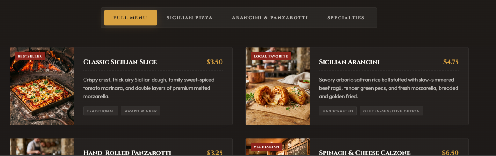

<div align="center">

# 🍕 Umberto North End

### A Premium Digital Menu for Boston's Historic Sicilian Pizzeria

[](https://umberto-north-end-live.vercel.app/)
[](https://developer.mozilla.org/en-US/docs/Web/HTML)
[](https://developer.mozilla.org/en-US/docs/Web/CSS)
[](https://developer.mozilla.org/en-US/docs/Web/JavaScript)

</div>

---

## Overview

**Umberto North End** is a premium **restaurant website** built for a fictional Boston institution, *Umberto's North End* — inspired by the historic Sicilian pizzerias of Boston's North End neighborhood. The site tells the story of a family-owned pizzeria since 1978, presenting its signature square Sicilian pizza, arancini, and panzarotti through warm, editorial design paired with rich interactive elements.

This project is a portfolio-grade example of a **restaurant landing page** that balances heritage storytelling with practical features like menu filtering, customer reviews, and location information — built entirely with HTML, CSS, and vanilla JavaScript.

---

## Preview




---

## Features

- 🌾 **Animated Flour Particle Hero** — a custom canvas animation simulates drifting flour dust across the hero section, reacting to mouse movement
- 🧭 **Responsive Navigation** — sticky header with a mobile hamburger menu and smooth scroll-spy active states
- 📖 **Our Story Section** — brand heritage narrative with a "years of experience" badge
- 🍕 **Filterable Signature Menu** — category tabs (Full Menu, Sicilian Pizza, Arancini & Panzarotti, Specialties) filter a grid of dish cards with pricing, descriptions, and tags
- 🖼️ **"Historic Menu Board" Showcase** — dedicated visual feature panel highlighting menu photography and key ingredient callouts
- ⭐ **Customer Reviews Carousel** — swipeable testimonial slider with star ratings and navigation dots
- 📸 **Photo Gallery with Lightbox** — hover-reveal gallery grid that opens into a full-screen image lightbox with navigation
- 🕐 **Live "Open/Closed" Status Indicator** — dynamically displays the pizzeria's current status based on Boston local time and posted hours
- 🗺️ **Custom Vector Map** — hand-styled CSS/SVG map showing the restaurant's location relative to North End landmarks
- ✉️ **Validated Contact Form** — inquiry form with field validation and a success confirmation overlay
- 🔍 **Structured SEO Data** — Schema.org JSON-LD markup for restaurant rich results

---

## Design Highlights

- **Editorial Typography** — Cinzel and Cinzel Decorative for heritage-driven headings, paired with Playfair Display and Outfit for body and accents
- **Warm, Heritage Color Palette** — brick reds, golds, and cream tones evoking a brick-oven pizzeria atmosphere
- **Scroll-Reveal Animations** — sections fade and slide into view as the user scrolls
- **Decorative Detailing** — circular "stamp" badges, gold dividers, and hand-drawn signature flourishes reinforce the artisanal brand feel
- **FontAwesome Iconography** — consistent icon language across hours, contact, and social sections

---

## Tech Stack

| Category | Technology |
|---|---|
| Markup | HTML5 |
| Styling | CSS3 (Custom) |
| Interactivity | Vanilla JavaScript |
| Icons | Font Awesome |
| Fonts | Cinzel, Cinzel Decorative, Playfair Display, Outfit |
| SEO | Schema.org JSON-LD |

---

## Customer Experience

The site is designed to guide a visitor exactly the way a first-time customer would explore a beloved local pizzeria: arriving at a warm, atmospheric hero, learning the founding story, browsing a filterable menu with pricing and tags, reading real-feeling reviews, and finally checking hours and directions before visiting. The live open/closed indicator and "cash only" notices add authentic, practical touches, while the gallery lightbox and reviews carousel keep the experience engaging without overwhelming the page.

---

## Performance & Responsiveness

Built with lightweight HTML, CSS, and vanilla JavaScript — no framework overhead — Umberto North End loads quickly and is **fully responsive across desktop, tablet, and mobile**. The navigation collapses into a mobile menu, the menu and gallery grids reflow into single columns on smaller screens, and touch gestures are supported for the review carousel, ensuring a smooth experience on any device.

---

## Live Demo

🔗 **[umberto-north-end-live.vercel.app](https://umberto-north-end-live.vercel.app/)**

---

## Repository

🔗 **[github.com/ShibamPandab/Umberto-North-End](https://github.com/ShibamPandab/Umberto-North-End)**

---

## Installation

```bash
# Clone the repository
git clone https://github.com/ShibamPandab/Umberto-North-End.git

# Move into the project directory
cd Umberto-North-End

# Open index.html directly in your browser,
# or serve it with a local development server
```

---

## Author

**Shibam Pandab**
🔗 [GitHub Profile](https://github.com/ShibamPandab)

---

## SEO Keywords

`Restaurant Website` · `Restaurant UI Design` · `Food Business Website` · `Restaurant Landing Page` · `Modern Dining Experience`

---

<div align="center">

*Crafted with HTML, CSS & JavaScript — a premium frontend showcase project.*

</div>
