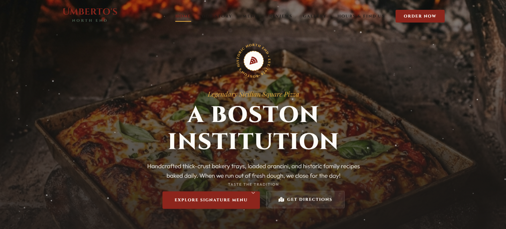

# Umberto North End

A modern restaurant landing page inspired by the famous North End dining experience. Built with a clean design, responsive layout, and smooth user experience.

## Live Demo

🌐 Live Site: [View Project](https://umberto-north-end-live.vercel.app/)

## Features

- Fully Responsive Design
- Modern Restaurant UI
- Mobile Friendly Layout
- Smooth Navigation
- Fast Loading Performance
- Clean and Professional Design

## Technologies Used

- HTML5
- CSS3
- JavaScript
- Vercel Deployment

## Preview

[Project Preview](./Menu.png)

## Project Goal

This project was built to practice modern frontend development principles, responsive layouts, and real-world business website design.

## Author

**Shibam Pandab**

- Portfolio: [P](https://shibam-portfolio-omega.vercel.app/)
- LinkedIn: [L](https://linkedin.com/in/shibam-pandab)
- GitHub: [G](https://github.com/ShibamPandab)
